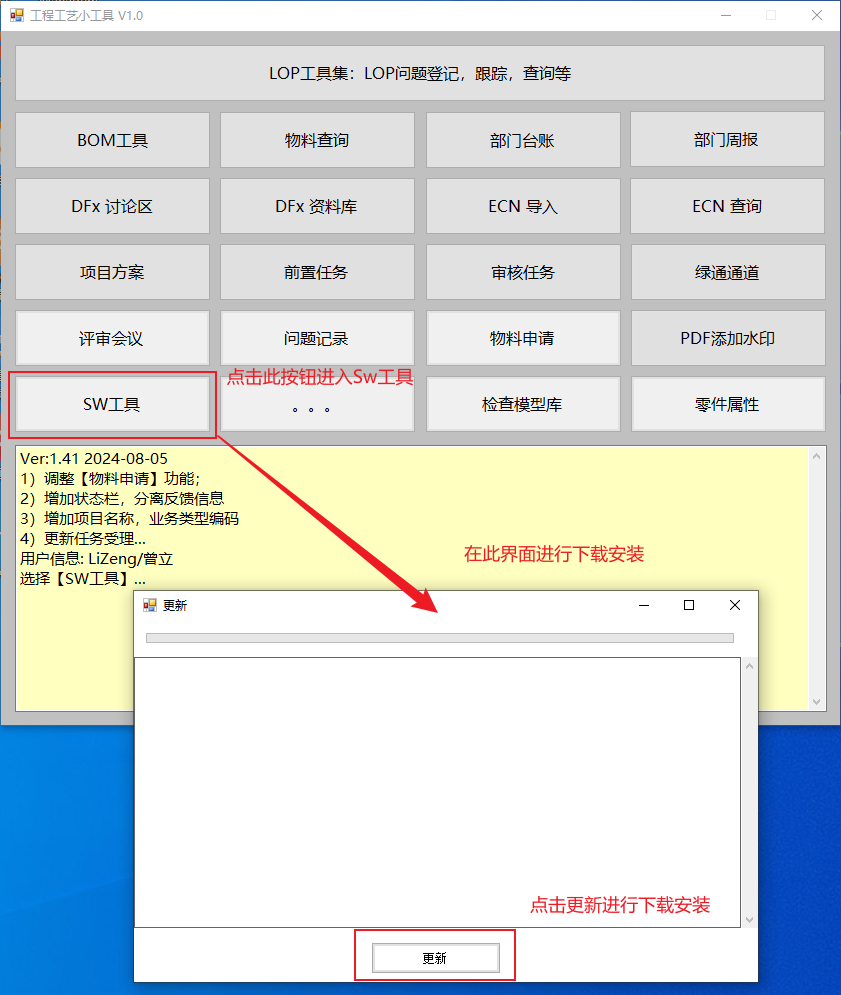
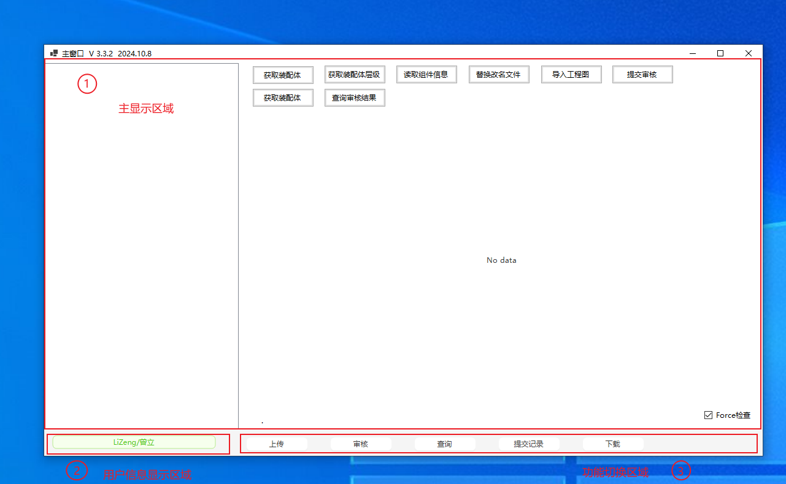
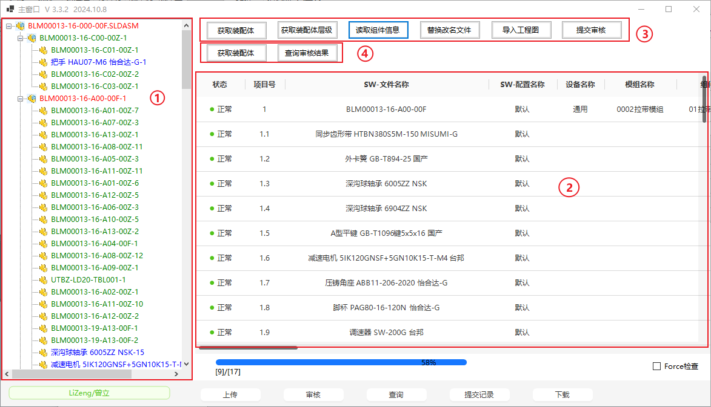
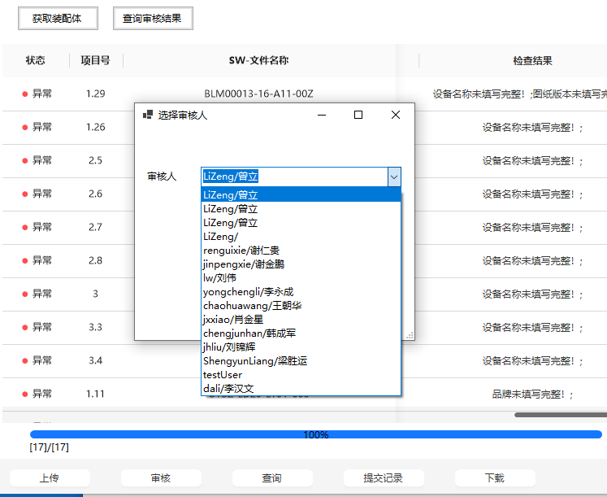
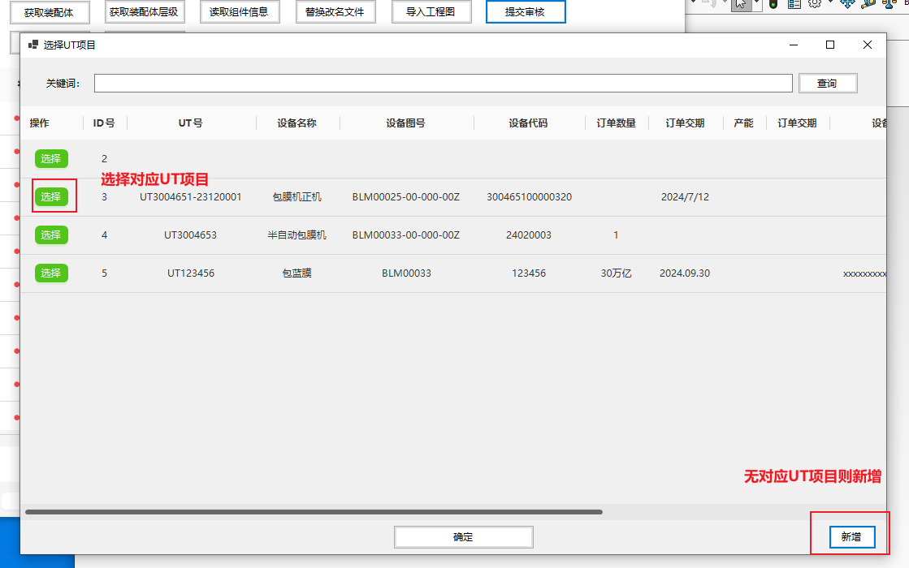
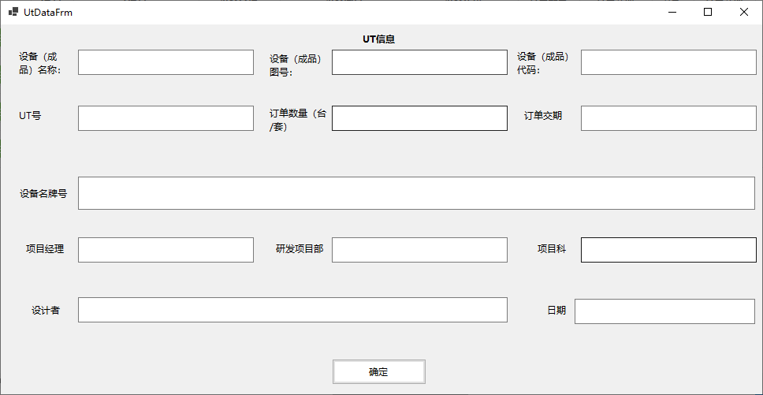
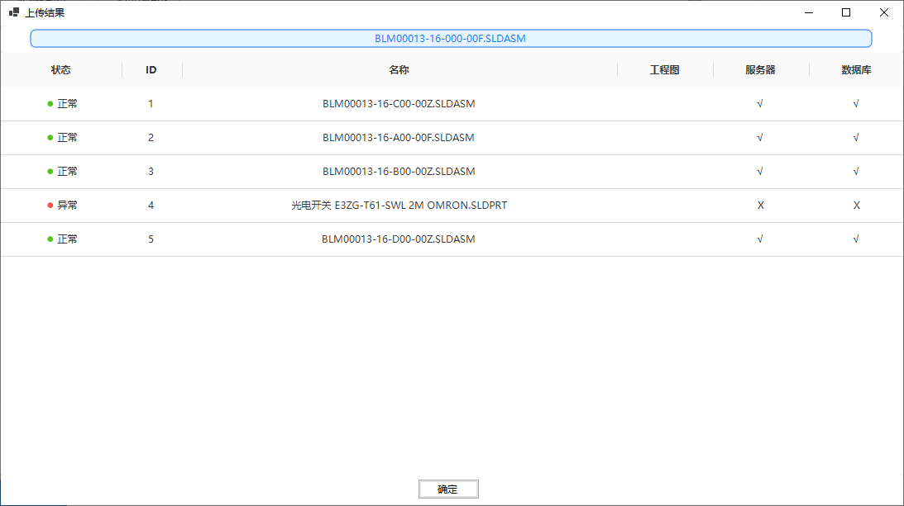
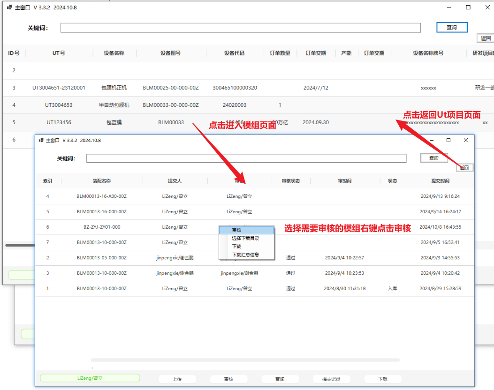
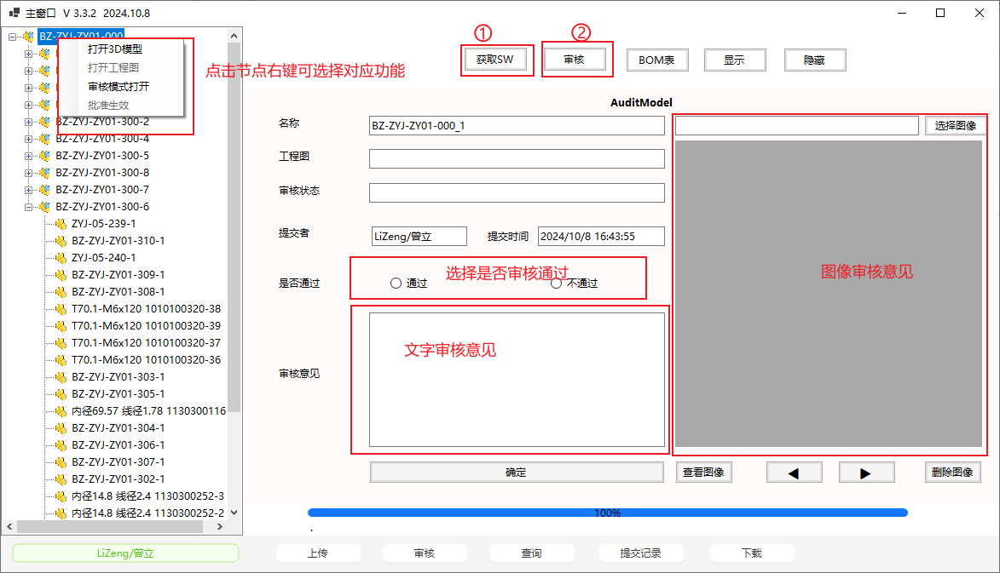

# Sw工具操作手册

## 一、下载安装

​	Sw工具集成在ERP-rom小程序，**使用此工具需先安装ERP-rom小程序**。[安装](http://10.39.8.16:8089/publish.htm) ERP-rom

在ERP-rom小程序的主界面中点击Sw工具按钮进入此工具。如图1-1所示。

​								          图1-1从ERP-rom启动Sw工具

## 二、主界面

Sw工具的主界面如图2-1所示。界面有三部分组成：

1. 主显示区域
2. 用户信息显示区域
3. 功能切换区域

点击功能切换区域的按钮可切换不同的功能。

​										图2-1 主界面

## 三、界面及操作

### 上传界面及操作

​	上传界面如图3-1所示，**从左到右依次执行完成 图3-1 中 3 区内的任务实现模组上传。**具体为以下步骤：

1. ***获取装配体***：选择在**SolidWorks中打开**的需要上传模组。

2. ***获取装配体层级***：对模组中的所有零件和装配体进行检查，将对**命名规范、层级和标准件引用路径**进行检查，检查结果显示在 **图3-1 的 1区域**。通过颜色对检查结过进行区分，同事鼠标悬浮在每个节点上可现实详细的检查结果信息。

   ​								           表3-1 节点颜色结果表

   | 颜色 |                         结果                         |
   | ---- | :--------------------------------------------------: |
   | 红色 | 错误：非标件命名错误、标准件不存在于*标准件库*中[^1] |
   | 蓝色 |           错误：标准件非引用*标准件库*[^1]           |
   | 绿色 |                         正确                         |

   

3. ***读取组件信息：***对模组中的零件和装配体进行属性检查和模型匹配。检查结构显示于 图3-1中的2区域。读取组件信息分为以下几个部分：

   * 读取零件属性，检查属性是否填写完整
   * *模型比较，将非标零件与非标件库中的零件进行模型对比，判断是否为**改名文件**[^2]或**修改模型文件***[^3]

   在对比完成后属性检查和模型对比信息显示在表格的***检查结果***列，点击表头可有限显示异常行。

4. ***替换改名文件：***如果存在改名文件，在确认后执行此步骤，工具将把非标件库中的模型和工程图下载到相同目录后执行装配体引用替换。

5. ***导入工程图：***查询库中与零件图号相同的工程图，如果本地无工程图则把查询到对应工程图下载到与零件模型同一目录下。

6. ***提交审核：***上传到服务器进行审核，上传有以下几个步骤：

   1. 选择审核人（图3-2）
   2. 选择提交到的UT项目（如果没有对应的UT项目则新建对应UT项目）（图3-3、3-4）
   3. 开始上传
   4. 显示上传结构（图3-5）

   

​											图3-1上传界面

​											图3-2选择审核人

​											图3-3选择Ut项目

​											图3-4增加Ut项目

​											图3-5上传结果

### 审核界面及操作

​	点击功能区域的审核按钮或查询按钮后显示Ut项目信息，点击表格中的Ut项目进入Ut项目下的模组信息，右键菜单栏进入审核，如图3-5所。结构如下：												

- 整机1
  - 模组1
  - 模组2
  - 模组3
  - ...
- 整机2
  - 模组1
  - 模组2
  - 模组3
  - ...
- ...

​												图3-5查询界面

进入审核界面后点击获取SW按钮连接到SolidWorks[^4]，点击审核后显示待审核的模组信息如图 3-6 所示。审核模式包括以下功能：

* 对但个零件进行审核
* 打开模型或工程图进行查看
* 审核意见附加文字信息和图像信息

当所有节点都审核通过后点击模组节点右键菜单中的***批准生效***将模组移动入库。

​											图3-6审核界面

### 查询界面及操作

**见审核界面及操作**

### 提交记录界面及操作

​	在提交记录中会记录每一次提交，可通过此界面下载到各提交版本，下载方法如 图3-7 所示。

​											图3-7 提交记录界面

## 注释

[^1]:D:\UT规范\标准件3D库2023（最新）
[^2]:  与非标件库中属性及模型相同，仅文件命名（图号）不同。
[^3]:非标件库中有相同名称（图号）的零件，但属性或模型不同

[^4]:模型和工程图打开在这个solidworks中
